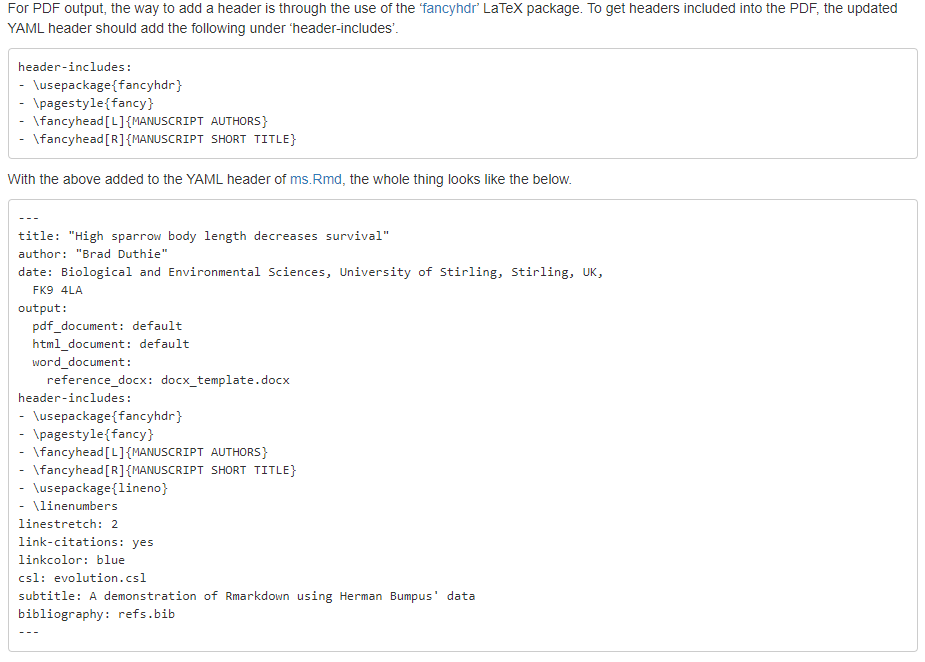
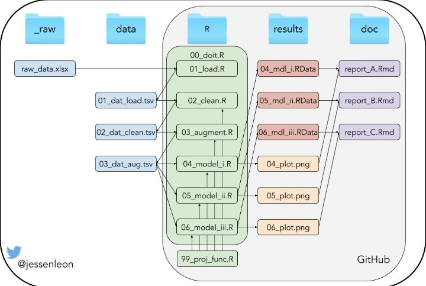

Launched in 2012. Developed by [Yihui Xie](https://yihui.org/)

# Why to use R Markdown?
+ R code in the text
+ BibTeX for references
+ LaTeX for equations
+ Links and comments
+ Version control (Git)
+ ...

# The main advantages
1. [Reproducible workflow](https://www.youtube.com/watch?v=s3JldKoA0zw)
2. Increase work efficiency (mid-large term)
3. High quality documents

In this R Markdown file you will find the basic concepts to be able to write scientific manuscripts in R. It is mainly based on [R Markdown: The Definitive Guide by Yihui Xie, J. J. Allaire, Garrett Grolemund](https://bookdown.org/yihui/rmarkdown/) and some other document that I find useful. All credits deserves to the authors of the original documents.

# 1. [Installation](https://bookdown.org/yihui/rmarkdown/installation.html)

```{r, eval = FALSE, echo = FALSE, message = FALSE}
# eval = FALSE; it is not recommended to install packages while knitting
install.packages('rmarkdown')
library(rmarkdown)
```


# 2. Basics: 
+ Opening: File -> New File -> R Markdown

+ 3 main components: (i) metadata, (ii) text, (iii) code

  (i) Metadata: written in a pair of 3 --- (see above). [YAML](https://en.wikipedia.org/wiki/YAML) syntax. Indentation important!!!
  
  (ii) Text: Markdown syntax
  
  (iii) 2 types:
    + Code chunk: written in a pair of 3 ```{r}; r indicates the language. Shortcut: Ctrl + Alt + i
    + Inline: written in a pair of 1 `r
    
## 2.1. [Example applications](https://bookdown.org/yihui/rmarkdown/basics-examples.html)

## 2.2. [Compile an R Markdown document](https://bookdown.org/yihui/rmarkdown/compile.html)
Ctrl + Shift + K ; Knit button ; rmarkdown::render("03-rmd/rmarkdown_eng.Rmd", output_dir = "04-doc")

## 2.3. [RStudio Cheat Sheets](https://rstudio.com/resources/cheatsheets/)
    
## 2.4. [Output formats](https://bookdown.org/yihui/rmarkdown/output-formats.html)
  + [html_document](https://bookdown.org/yihui/rmarkdown/html-document.html) -> [R Notebook](https://bookdown.org/yihui/rmarkdown/notebook.html)
  + [word_document](https://bookdown.org/yihui/rmarkdown/word-document.html)
  + [pdf_document](https://bookdown.org/yihui/rmarkdown/pdf-document.html): 
      + [TinyTeX](https://yihui.name/tinytex/)(For R Markdown users who have not installed LaTeX before)
      + [Journals](https://bookdown.org/yihui/rmarkdown/journals.html)
      + package [rticles](https://github.com/rstudio/rticles)

```{r, echo = FALSE}
# install.packages("rticles")
library(rticles)
rticles::journals()
# how to use a template: https://bookdown.org/yihui/rmarkdown/rticles-usage.html
```

## 2.5. [Markdown syntax](https://bookdown.org/yihui/rmarkdown/markdown-syntax.html). [Pandoc’s Markdown](https://pandoc.org/MANUAL.html)

+ Help -> Markdown Quick Reference (italics, bold, headers, lists, links, images, R codes, tables, page break, superscripts...)

### 2.5.1. Inline formatting
**bold**, *italics*, subscript~1~, superscript^2^, codes, [hyperlinks](https://bookdown.org/yihui/rmarkdown/markdown-syntax.html), footnote ^[hello world], images, , citations (BibTeX recommended. Add to the YAML metadata, @RCoreTeam2019)

### 2.5.2. Block-level elements
Headers (# first level; ## second level...), lists and sub-lists (*, -, +), blockquotes

> "R Markdown is a great tool"
>
> --- Julen Astigarraga

### 2.5.3. Math expressions
Written in a pair of dollar using the LaTeX syntax, e.g., $f(how) = {do \choose you} feel^{excellent} (1-p)^{n-k}$. You can also use math environments inside, e.g., $\delta$ or $\beta$

<!--this is a comment not shown in the output (analogue to #)-->

## 2.6. [R code chunks and inline R code](https://bookdown.org/yihui/rmarkdown/r-code.html): Ctrl + Alt + I

+ *eval*: Whether to evaluate a code chunk.

+ *echo*: Whether to echo the source code in the output document (someone may not prefer reading your smart source code but only results).

+ *results*: When set to 'hide', text output will be hidden; when set to 'asis', text output is written “as-is”, e.g., you can write out raw Markdown text from R code.

+ *collapse*: Whether to merge text output and source code into a single code block in the output. This is mostly cosmetic: collapse = TRUE makes the output more compact, since the R source code and its text output are displayed in a single output block. The default collapse = FALSE means R expressions and their text output are separated into different blocks.

+ *warning, message, and error*: Whether to show warnings, messages, and errors in the output document. Note that if you set error = FALSE, rmarkdown::render() will halt on error in a code chunk, and the error will be displayed in the R console. Similarly, when warning = FALSE or message = FALSE, these messages will be shown in the R console.

+ *include*: Whether to include anything from a code chunk in the output document. When include = FALSE, this whole code chunk is excluded in the output, but note that it will still be evaluated if eval = TRUE. When you are trying to set echo = FALSE, results = 'hide', warning = FALSE, and message = FALSE, chances are you simply mean a single option include = FALSE instead of suppressing different types of text output individually.

+ *cache*: Whether to enable caching. If caching is enabled, the same code chunk will not be evaluated the next time the document is compiled (if the code chunk was not modified), which can save you time. However, I want to honestly remind you of the two hard problems in computer science (via Phil Karlton): naming things, and cache invalidation. Caching can be handy but also tricky sometimes.

+ *fig.width* and *fig.height*: The  size of R plots in inches. You can also specify the two options together in a single chunk option fig.dim, e.g., fig.dim = c(6, 4) means fig.width = 6 and fig.height = 4.

+ *out.width* and *out.height*: The output size of R plots in the output document. These options may scale images. You can use percentages, e.g., out.width = '80%' means 80% of the page width.

+ *fig.align*: The alignment of plots. It can be 'left', 'center', or 'right'.

+ *dev*: The graphical device to record R plots. Typically it is 'pdf' for LaTeX output, and 'png' for HTML output, but you can certainly use other devices, such as 'svg' or 'jpeg'.

+ *fig.cap*: The figure caption.

+ *child*: You can include a child document in the main document. This option takes a path to an external file.

### 2.6.1. Figures

```{r, fig.cap = "iris and cars are some of the most popular ones"}
plot(iris, pch = 18)
plot(cars, pch = 19)
```

```{r, echo = FALSE, fig.align = 'center', fig.cap = "A nice one!"}
knitr::include_graphics('../01-images//rmarkdown.png')
```

### 2.6.2. Tables: help -> Markdown Quick Reference

This is worst  | than
------------- | -------------
using arcgis  | and creating six files
each time | you create a layer

```{r, echo = FALSE, fig.align = 'center', fig.cap = "R Markdown is not such a great tool!"}

```

WAIT BEFORE COMMENTING ANYTHING... I recommend taking a look at the *flextable* package when working with tables

+ [flextable overview](https://davidgohel.github.io/flextable/articles/overview.html)

+ [officer package](https://davidgohel.github.io/officer/)

+ [add flextable into a Word document](https://rdrr.io/cran/flextable/man/body_add_flextable.html)

```{r, eval = TRUE, include = FALSE}
library(flextable)
library(officer)
library(tidyverse)

names(iris)

iris_sel <- iris %>%
  select(Sepal.Length : Species, -Sepal.Width) %>%
  group_by(Species) %>%
  summarise(Mean_Sepal.Length = mean(Sepal.Length)) %>%
  rename("Mean Sepal Length" = Mean_Sepal.Length)
  
glimpse(iris_sel)

doc <- read_docx()
# the word file where you want the table to be created can be specified with the path argument. If none is specified, this file will be an empty document located in the working directory

# the table
ftglobal <- flextable(iris_sel) %>%
  theme_zebra() %>%
  align(align = "center", part = "header") %>%
  align(align = "center", part = "body") %>%
  autofit(add_w = 0.1, add_h = 0.1) %>% # layout
  colformat_num(col_keys = "Mean Sepal Length", na_str = "-", digits = 2)

# print(ftglobal, preview = "docx") # in an interactive session (preliminary output)

body_add_flextable(doc, value = ftglobal) %>% 
  print(target = "../02-tables//iris.docx") # output
```

# 2.7. [Other language engines](https://bookdown.org/yihui/rmarkdown/language-engines.html)

```{r, echo = FALSE, eval = TRUE, warning = FALSE}
library(knitr)
names(knitr::knit_engines$get())
library(reticulate) # for python
```

```{python, echo = FALSE, results = 'asis'}
x = 'Python is better than R!'
print(x.split(' '))
```


# 2.8. [Interactive documents](https://bookdown.org/yihui/rmarkdown/interactive-documents.html)


# Let's start writing the paper!

```{r, echo = FALSE, fig.align = 'center', fig.cap = "This is how I feel now"}

# 
```


# 3. [How to write manuscripts in Rmarkdown Brad Duthie](https://stirlingcodingclub.github.io/Manuscripts_in_Rmarkdown/Rmarkdown_notes.html)

Titles coloured in light blue, the text is not double spaced, there are no line numbers...(manuscript rejected!) BUT WE ARE NOT GOING TO EDIT ANYTHING IN WORD! We can ensure that the created .docx always has the desired format by using a .docx template. To use it, the template document must be placed in the same folder as the script file "rmarkdown_eng.Rmd", and we must make a small adjustment in the YAML of "rmarkdown_eng.Rmd" (we remove the default).

<div custom-style=Lists> L351-355: </div>

## 3.1. References
The idea of using BibTeX is to avoid having to manually format the references and instead type a unique "key" (citation key: @cite) each time a reference is cited. In addition, another very important advantage is that BibTeX allows authors to change the reference styles without having to manually reformat anything (for example, if a manuscript needs to be sent to a different journal). We will extract the references through the Mendeley reference manager but other managers such as Zotero, RefWorks or Endnote can be used.

+ Select the references that interest us -> File -> export

+ We can add a few words before the quote without problems: Example: @RCoreTeam2019 published an article announcing the exit of Rstudio [e.g., @RCoreTeam2019].

+ Note: .bib files use LaTeX code instead of Rmarkdown to format the text. The only place this is likely to be important is when the words in the .bib file must be italicised (e.g., scientific names). This is solved by modifying the .bib {\ it Fagus sylvatica}. In the YAML we add 'bibliography: refs.bib.'

+ link-citations: to include links between citations and bibliography

+ linkcolor: e.g., blue

+ [Citation Style Language](https://en.wikipedia.org/wiki/Citation_Style_Language): Many of them are [available in GitHub](https://github.com/citation-style-language/styles). It is important to remember that the .csl file has to be in the same directory as the .Rmd file.

+ If we want to place the bibliography in a specific part of the paper where it is not at the:  <div id="refs"></div> 

## 3.2. Further info
+ pdf output. [See more info in Brad Duthie document](https://stirlingcodingclub.github.io/Manuscripts_in_Rmarkdown/Rmarkdown_notes.html)


+ How to create a link within the document to an appendix: [Appendix Table 1](#appendix).

<a name="appendix">Appendix Table 1</a>

+ File organization is extremely important. An example from @ jessenleon 
